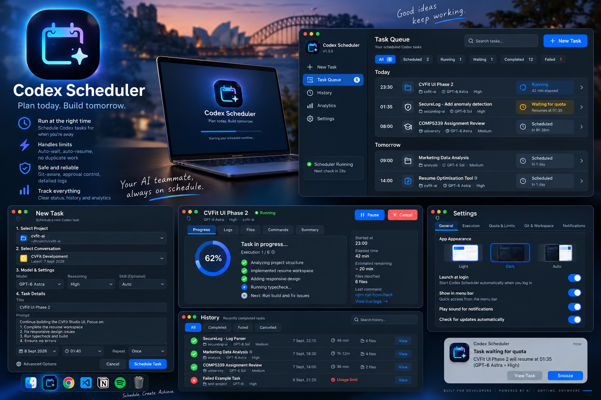

# Codex Scheduler v1.4.7

[English](README.md) | **简体中文**

一个面向 macOS 的本地 Codex 定时调度工具和 Codex 插件，用来在已有 Codex 会话中安排未来任务、跨额度窗口等待，并安全地继续被中断的工作。

> **非官方社区项目。** Codex Scheduler 与 OpenAI 无隶属、赞助或官方维护关系。Codex、ChatGPT 等名称可能属于其各自权利人。

> **本地自动化拥有真实权限。** 定时任务会通过你的本地 Codex 环境，按照你选择的权限执行。把任务长期无人值守前，请确认 Prompt、工作区权限、网络访问和审批设置。



封面是概念示意图，可能与当前界面略有不同。

## 主要功能

- **英文 + 简体中文界面：** 默认跟随系统语言，也可在设置中即时切换；语言偏好只保存在本地，不会启动 Codex 模型调用。
- **本地管理路径：** 创建、编辑、暂停、删除、查看和等待都属于本地操作，不会主动启动 Codex 模型 turn。
- **精确定时：** 可选择具体日期和 HH:MM 时间。
- **真实 Codex 选项：** 从缓存/实时 metadata 中选择会话、项目、模型、Reasoning、Skills 和 Apps。
- **多任务队列：** 可同时安排多个项目和会话。
- **额度恢复等待：** 当 Codex 返回额度重置时间时，等待到重置时间 + 2 分钟后再试，避免频繁轮询。
- **Checkpoint 自动续跑：** 保留工作区状态，在中断后继续同一会话。
- **Repo / Thread 安全：** 同一工作区和同一会话写入会串行化；Git baseline/checkpoint metadata 无需模型调用即可记录。
- **审批安全：** 无人值守任务不会自动批准敏感交互请求。
- **耐久任务队列：** 事务化任务存储、队列 revision、恢复快照和本地事件日志可避免旧 worker 覆盖其他任务。
- **安全 writer 交接：** 区分真实运行中的 turn 与 ChatGPT Desktop 保留的 writer ownership。自动交接默认关闭，且仅在会话明确空闲时请求 ChatGPT 正常退出。
- **通知：** 支持 macOS 完成、额度等待、需要审批和失败通知。

## 系统要求

- macOS 12 或更高
- Python 3.10+
- 本地 Codex，或包含 Codex binary 的 ChatGPT Desktop
- Git 可选；支持非 Git 工作区

运行时目前只使用 Python 标准库。

## 安装

下载或 clone 仓库后运行：

```bash
cd /path/to/codex-native-scheduler
python3 install.py
```

也可以在 Finder 中双击 `Install Codex Scheduler.command`。安装输出会尽量跟随 macOS 系统语言。

安装程序会创建或更新：

- `~/.codex/plugins/codex-native-scheduler`
- `~/Applications/Codex Scheduler.app`
- `~/Library/LaunchAgents/com.codex.native-scheduler.plist`
- `~/Library/Application Support/CodexNativeScheduler`
- `~/.agents/plugins/marketplace.json` 中的 Codex Personal Local Plugin 条目

不会删除其他 marketplace 条目，也不会在安装后自动重启 ChatGPT。

### 打开本地应用

```bash
open "$HOME/Applications/Codex Scheduler.app"
```

或者使用 Spotlight 搜索 **Codex Scheduler**。

### 语言切换

打开 **设置 → 界面语言**，选择 **跟随系统**、**English** 或 **简体中文**。语言偏好保存在本机浏览器本地存储中，不修改任务数据，也不会触发模型调用。

### macOS Gatekeeper

此社区版本目前未进行代码签名或 notarization。安装前请先检查源码；如果 macOS 阻止下载的脚本/应用，请仅在确认文件来源和内容后使用系统提供的安全设置放行。

## 工作原理

### 耐久任务队列

任务持久化采用事务方式。运行中的 worker 只更新自己的任务；每次变更都会推进队列 revision；系统保留恢复快照；UI 会忽略乱序到达的旧任务快照。

### 安全 Thread Handoff

Codex 每个 thread 同时只允许一个 active writer。Scheduler 会区分真实活动 turn 和“会话已空闲但 writer 仍被其他客户端保留”的情况。前者保持 `waiting_for_thread`，后者进入 `waiting_for_handoff` 并显示本地诊断。

Scheduler 不会删除或绕过 Codex writer lock。可选的 **允许自动交接 ChatGPT writer** 默认关闭。开启后，仅当 Codex 明确报告 thread 空闲、并且本地诊断确认持有者是 ChatGPT Desktop 时，才会请求 ChatGPT 正常退出；不会使用强制 kill。

### 额度行为

如果任务在 Codex turn 真正开始前失败，会保留原 Prompt 等待之后重试。如果 turn 已开始后因为额度中断，则记录本地 checkpoint，下一次在同一会话中使用紧凑 continuation prompt 继续。

### Git 行为

默认在所选工作区运行任务，并使用每仓库文件锁让定时写入串行执行。Git 可用时会记录 baseline/checkpoint metadata。实验性的隔离 worktree 模式会在 Scheduler Application Support 目录下创建 detached worktree。

## 执行状态

内部状态保持语言无关，例如 `pending`、`running`、`waiting_for_quota`、`waiting_for_thread`、`waiting_for_handoff`、`needs_approval`、`succeeded`、`failed` 等；界面负责显示对应的中文或英文标签。

## 隐私与本地存储

任务定义、checkpoint、metadata 缓存、设置和执行历史默认保存在：

```text
~/Library/Application Support/CodexNativeScheduler
```

本地 UI server 只绑定 `127.0.0.1` 的临时端口，并使用每次启动生成的内存 token、localhost Host/Origin 校验和严格浏览器安全 header。它只用于本机，不应通过端口转发或公网反向代理暴露。

Scheduler 不会调用模型来总结 checkpoint。只有任务真正执行时，配置的 Prompt 和上下文才可能发送给 Codex。

## 卸载

运行或双击 `Uninstall Codex Scheduler.command`。插件、本地 App 和 LaunchAgent 会被移除，但 `~/Library/Application Support/CodexNativeScheduler` 下的任务历史会保留。

## 开发与测试

```bash
python3 -m unittest discover -s tests -p 'test_*.py' -v
python3 -m compileall -q server install.py tests
```

参见 [CONTRIBUTING.zh-CN.md](CONTRIBUTING.zh-CN.md) 和 [SECURITY.zh-CN.md](SECURITY.zh-CN.md)。

## 版本

当前版本：**1.4.7**。参见 [CHANGELOG.zh-CN.md](CHANGELOG.zh-CN.md)。

## 许可证

MIT License，参见 [LICENSE](LICENSE)。
